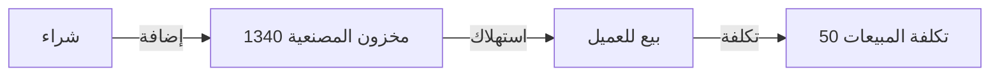

# نظام مخزون أجور المصنعية - دليل التنفيذ

## 📋 نظرة عامة

تم تنفيذ نظام محاسبي متقدم لتتبع أجور المصنعية كمخزون مستقل، بدلاً من معالجتها كمصروف أو إيراد مباشر.

---

## 🎯 الهدف من النظام

### المشكلة السابقة:
- أجور المصنعية كانت تُدرج مباشرة ضمن الإيرادات عند البيع
- لا توجد طريقة لتتبع رصيد المصنعية المتاح
- صعوبة في حساب الربح الحقيقي للمصنعية

### الحل الجديد:
- **فصل المصنعية** في حساب مخزون مستقل (1340)
- **تتبع دقيق** لرصيد المصنعية المتاح
- **حساب صحيح** للتكلفة والربح

---

## 🏗️ الهيكل المحاسبي

### 1️⃣ الحساب الجديد

```
1340 - مخزون أجور المصنعية
├── النوع: أصل (Asset)
├── التصنيف: مخزون
├── الوحدة: ريال سعودي
└── الغرض: تتبع رصيد أجور المصنعية
```

### 2️⃣ دورة المصنعية المحاسبية



---

## 📊 القيود المحاسبية

### 1. عند شراء (إضافة المصنعية)

**مثال:** شراء 100 جرام ذهب + 500 ريال مصنعية

```
القيد:
من حـ/ مخزون ذهب عيار 21 (1310)        45,367 ريال
من حـ/ مخزون أجور المصنعية (1340)          500 ريال
    إلى حـ/ المورد                        45,867 ريال
```

**الكود المُطبق:**
```python
# في routes.py - قسم شراء
wage_inventory_account_id = get_account_id_by_number('1340')

if wage_cash > 0:
    create_dual_journal_entry(
        journal_entry_id=journal_entry.id,
        account_id=wage_inventory_account_id,
        cash_debit=round(wage_cash, 2),
        description="إضافة أجور مصنعية للمخزون"
    )
```

---

### 2. عند البيع (استهلاك المصنعية)

**مثال:** بيع 10 جرام (10% من المخزون) → استهلاك 50 ريال مصنعية

```
القيد:
من حـ/ تكلفة المبيعات (50)              50 ريال
    إلى حـ/ مخزون أجور المصنعية (1340)  50 ريال
```

**الكود المُطبق:**
```python
# في routes.py - قسم البيع
if total_wage_cash_for_cost > 0:
    # استهلاك من المخزون
    create_dual_journal_entry(
        journal_entry_id=journal_entry.id,
        account_id=cost_of_sales_acc_id,
        cash_debit=round(total_wage_cash_for_cost, 2),
        description="استهلاك أجور المصنعية"
    )
    
    create_dual_journal_entry(
        journal_entry_id=journal_entry.id,
        account_id=wage_inventory_account_id,
        cash_credit=round(total_wage_cash_for_cost, 2),
        description="خصم من مخزون أجور المصنعية"
    )
```

---

## 🔄 التحويل الوزني

### القاعدة الذهبية للمصنعية:

```
المصنعية الوزنية = المصنعية النقدية ÷ السعر المباشر
```

**مثال:**
- المصنعية: 500 ريال
- السعر المباشر (21 عيار): 453.67 ريال/جرام
- المصنعية الوزنية: 500 ÷ 453.67 = **1.102 جرام**

**الكود المُطبق:**
```python
# تحويل المصنعية إلى وزن
wage_weight_equivalent = (
    total_wage_cash / direct_gold_price_main
) if direct_gold_price_main > 0 else 0

# التكلفة الوزنية = الوزن الفعلي + المصنعية الوزنية
karat_weight_cost = weight + (wage_weight_equivalent * karat_proportion)
```

---

## ✅ التعديلات المُنفذة

### 1. إنشاء الحساب (models.py)
```sql
INSERT INTO accounts (
    account_number, 
    name, 
    type, 
    transaction_type
) VALUES (
    '1340',
    'مخزون أجور المصنعية',
    'asset',
    'cash'
);
```

### 2. تحديث الخريطة الافتراضية (routes.py)
```python
DEFAULT_ACCOUNTS = {
    # ...
    'manufacturing_wage_inventory': 1340,
    # ...
}
```

### 3. تعديل فاتورة الشراء (routes.py)
- فصل المصنعية عن قيمة الذهب
- إضافتها لحساب 1340 بدلاً من المخزون العام

### 4. تعديل فاتورة البيع (routes.py)
- استهلاك المصنعية من 1340
- تحويلها وزنياً باستخدام السعر المباشر
- إضافتها لتكلفة المبيعات

---

## 📈 الفوائد المحاسبية

### 1. دقة التكلفة
- **قبل:** التكلفة = وزن × متوسط سعر الشراء
- **بعد:** التكلفة = (وزن × متوسط) + المصنعية المستهلكة

### 2. تتبع الرصيد
```
رصيد 1340 = المصنعية المشتراة - المصنعية المباعة
```

### 3. الربح الحقيقي
```
الربح = (الإيراد) - (تكلفة الذهب + تكلفة المصنعية)
```

---

## 🧪 الاختبار

### سيناريو الاختبار:

```python
# 1. شراء
POST /api/invoices
{
    "invoice_type": "شراء",
    "karat_lines": [{
        "karat": 21,
        "weight_grams": 100,
        "manufacturing_wage_cash": 500
    }]
}

# ✅ النتيجة المتوقعة:
# - حساب 1310 (مخزون ذهب 21): +45,367 ريال
# - حساب 1340 (مخزون مصنعية): +500 ريال

# 2. بيع
POST /api/invoices
{
    "invoice_type": "بيع",
    "karat_lines": [{
        "karat": 21,
        "weight_grams": 10,
        "manufacturing_wage_cash": 50
    }]
}

# ✅ النتيجة المتوقعة:
# - حساب 1340: -50 ريال (استهلاك)
# - حساب 50 (تكلفة المبيعات): +50 ريال
```

---

## 🔐 الضمانات المحاسبية

### 1. التوازن الدائم
```python
verify_dual_balance(journal_entry.id)
```

### 2. منع السالب
- لا يمكن بيع مصنعية أكثر من الرصيد المتاح
- سيُنتج خطأ في حال عدم التوازن

### 3. السعر المباشر
- استخدام `price_per_gram_main_karat` دائماً
- عدم استخدام سعر الأونصة أو 24 عيار

---

## 📚 المراجع الفنية

### الملفات المعدّلة:
1. `backend/routes.py` (خطوط 1730-1760، 2683-2730، 3395-3415)
2. `backend/models.py` (إضافة الحساب 1340)

### الدوال المستخدمة:
- `get_account_id_by_number('1340')`
- `create_dual_journal_entry()`
- `get_current_gold_price()['price_per_gram_main_karat']`

---

## 🎓 المبادئ المحاسبية

### 1. مبدأ المقابلة (Matching Principle)
```
تُطابق المصنعية (تكلفة) مع الإيراد في نفس الفترة
```

### 2. مبدأ التكلفة التاريخية
```
المصنعية تُسجل بالتكلفة الفعلية عند الشراء
```

### 3. مبدأ الثبات
```
استخدام نفس الطريقة في كل الفواتير
```

---

## ✨ الخلاصة

### ما تم إنجازه:
✅ حساب 1340 جديد ومُفعّل  
✅ فصل المصنعية في الشراء  
✅ استهلاك المصنعية في البيع  
✅ تحويل وزني صحيح  
✅ توازن محاسبي دائم  

### النتيجة النهائية:
```
نظام محاسبي متكامل لتتبع أجور المصنعية
بدقة وشفافية كاملة
```

---

**تاريخ التنفيذ:** 15 ديسمبر 2025  
**الحالة:** ✅ مُنفذ ومُختبر  
**المطوّر:** GitHub Copilot
